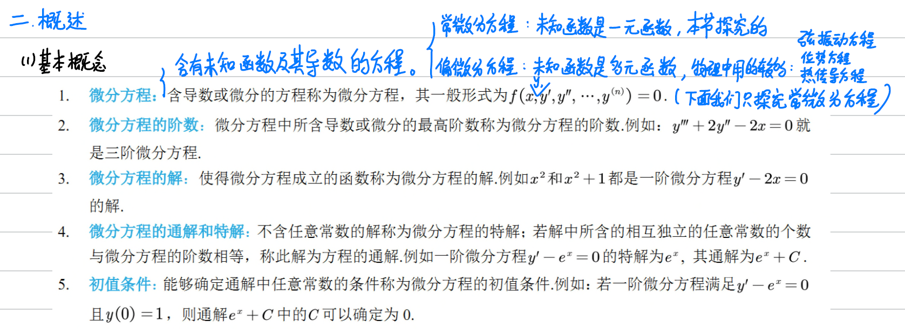
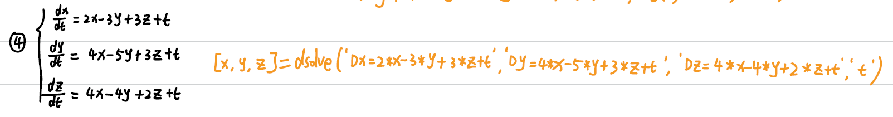
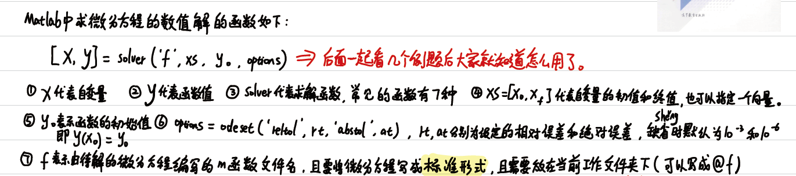
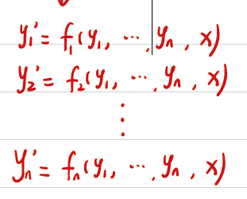
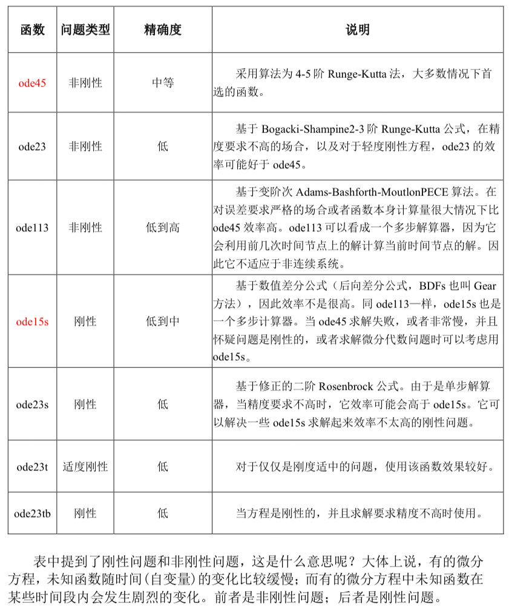
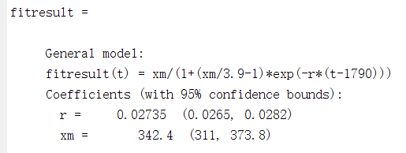
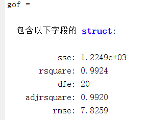

# 微分方程前置知识

-   基本概念

    
-   求解能找到解析解就找解析解，不能找到就求数值解（大部分问题都只能求数值解）
-   有多少个微分方程，就需要提供多少个初始值，微分方程有多少阶，就要提供多少个初始值
-   语法
    -   求解析解
        -   格式(注意初始条件写在同一个' '里面，方程分开写)

            
            -   在表达微分方程时，用字母D表示微分，D2，D3分别表示二阶、三阶微分，后面跟的是要求解的因变量
            -   自变量可以指定，不写时Matlab会默认为t&#x20;
            -   初始值可以不给, 不给求出来的就是通解;
            -   如果有多个微分⽅程, 那么计算的实际上是微分⽅程组;
            -   如果微分⽅程形式较为复杂, 往往是得不到解析解的，会报错
            -   dsolve('y-Dy=a\*x','x')  % a是一个未知的参数
        -   例子

            
    -   求数值解（matlab只能求解一阶的微分方程，并且在建模比赛中基本上出现的都是一阶微分方程）
        -   格式

            

            
            -   solver函数
                非刚性问题（大多数问题都是，如果ode45求解不出来或者求解很慢，判断这是不是刚性问题，考虑使用ode15s）：ode45

                刚性问题：ode15s

                
            -   注意：

                
    -   额外补充：

        simplify(y)  % simplify函数可以简化表达式y
        latex(y) % 将函数y转换成latex代码，复制到Axmath或者word自带的公式编辑器
-   可视化
    -   有解析解
        -   方法一：
            -   直接用fplot(y,\[lb,ub])画图
        -   方法二：
            -   自行生成x，可以将x的间隔设小一点，更精确
            -   设变量y，用x表达y，记得要把乘除换成点乘和点除，^→.^
    -   只有数值解
        -   只需将返回的x和y传入plot即可
-   建模步骤
    -   首先列出微分方程
    -   然后求出解析解，如果参数无法确定，需要使用已有数据进行拟合，得到参数值
        拟合后可以生成解析式的函数代码，保存后调用，返回两个结果
        -   \[fitresult, gof] = createFit(year, population)&#x20;

            fitresult包括：拟合的模型（函数解析式）、拟合得到的参数及其相应的置信区间

            
            
            gof包括：SSE、R²、DFE、调整后的R²、RMSE
            
            
            
            1.  SSE (Sum of Squared Errors)：**SSE 是残差平方和（误差平方和）**，表示拟合曲线与原始数据之间的误差的总和。计算方法是将每个数据点的拟合值与对应的实际观测值之差平方后求和。
            2.  **R-squared (R方或拟合优度)**：R-squared 衡量了拟合模型对因变量变异的解释能力，即拟合曲线能解释原始数据方差的比例。取值范围在 0 到 1 之间，越接近 1 表示拟合模型对数据的解释越好，越接近 0 表示解释能力较差。
            3.  DFE (Degrees of Freedom Error)：DFE 是误差的自由度，它表示拟合模型中用于计算 SSE 的独立观测值的数量。DFE 等于样本数据点数量减去拟合模型中的参数个数。
            4.  Adj. R-squared (Adjusted R-squared)：**调整了自由度的拟合优度**，是对 R-squared 进行校正后的值，考虑了模型中自变量的个数。它是一个更稳健的评估指标，防止因为增加自变量导致 R-squared 过于乐观。
            5.  RMSE (Root Mean Square Error)：**均方根误差**，是 SSE 的平均值的平方根，表示拟合曲线的预测误差。RMSE 越小，拟合模型的预测准确度越高。
    -   预测：将要预测的自变量代入解析式中，得到预测结果
